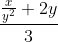

**Exercise 1.8**: Newton's method for cube roots is based on the fact that if
*y* is an approximation to the cube root of *x*, then a better approximation
is given by the value



Use this formula to implement a cube-root procedure analogous to the
square-root procedure. (In Section 1.3.4 we will see how to implement Newton's
method in general as an abstraction of these square root and cube root
procedures.

↳

A complete solution is listed here:

```scheme
(define (square x)
  (* x x))

(define (improve guess x)
  (/ (+ (/ x (square guess)) (* 2 guess)) 3))

(define (good-enough? previous-guess guess)
  (< (abs (/ (- guess previous-guess) guess)) 0.00000000001))

(define (cbrt-iter guess x)
  (if (good-enough? guess (improve guess x))
    guess
    (cbrt-iter (improve guess x) x)))

(define (cbrt x)
  (cbrt-iter 1.0 x))
```
