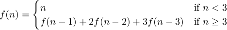

**Exercise 1.11**: A function *f* is defined by the rule that



Write a procedure that computes *f* by means of a recursive process. Write a
procedure that computes *f* by means of an iterative process.

↳

Here is a recursive version:

```scheme
(define (f n)
  (if (< n 3)
      n
      (+ (f (- n 1)) (* 2 (f (- n 2))) (* 3 (f (- n 3))))))
```

Currently at a loss for understanding the iterative versions out there.
