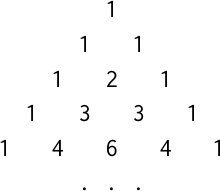

**Exercise 1.12**: The following pattern of numbers is called *Pascal's
triangle*.



The numbers at the edge of the triangle are all 1 and, and each number inside
the triangle is the sum of the two numbers above it. Write a procedure that
computes elements of Pascal's triangle by means of a recursive process.

↳

In English, the procdure could be described as follows: if the row is 1,
return 1. If the column is 1 or is equal to the row, also return 1. Otherwise
return the number that is the sum of the two numbers in the triangle located
at row - 1 and column - 1 and row - 1, leaving column the same. The process
will trace back to the very beginning. In Scheme though? Here:

```scheme
(define (pascal row column)
  (cond ((= row 1) 1)
        ((or (= column 1) (= column row)) 1)
        (else (+ (pascal (- row 1) (- column 1))
                 (pascal (- row 1) column)))))
```
