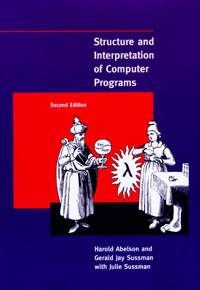

# SICP Solutions
# Solutions to the legendary CS textbook Structure and Interpretation of Computer Programs

I thought *How to Design Programs* was going to be easier and maybe it is but
I read somewhere that it uses some dumb picture language throughout whereas
*Structure and Interpretation of Computer Programs* only has one section that
does so (which I intend to skip) so SICP it is.

I am using the `sicp` package in Racket, which can be installed with or
without `sudo`, depending on whether you want a system-wide or local
installation, with `raco pkg install sicp`. To use it, make sure you have
`#lang sicp` at the top of any source file, or in the editor window of
DrRacket.
